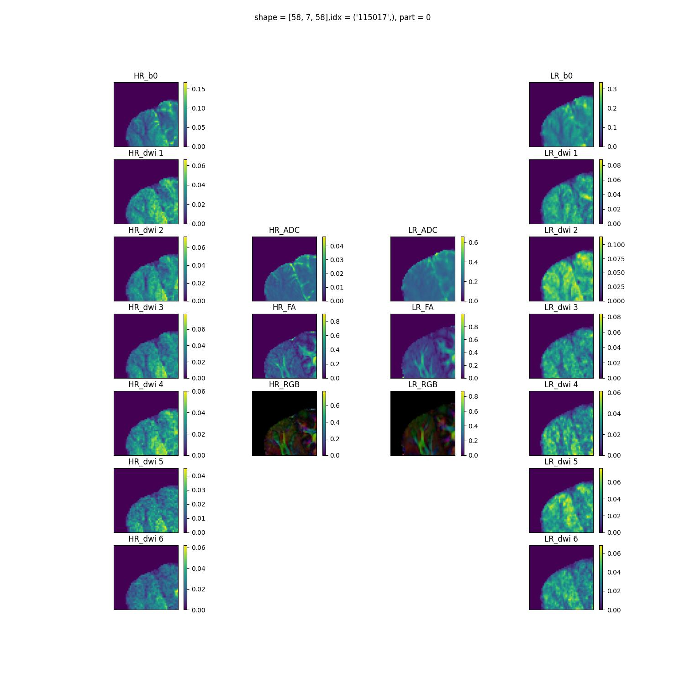

# FastDTI — 3D Scale-Arbitrary Super-Resolution for Diffusion Tensor Imaging

Implementation and training code for **FastDTI**, a single-pass 3D convolutional autoencoder that super-resolves diffusion MRI (dMRI) directly into clinical parametric maps — mean diffusivity (MD), fractional anisotropy (FA), and principal diffusion direction (D-Maps) — from just six diffusion-weighted images (DWIs) and one b₀ image, at an arbitrary (non-integer) upscaling factor.

This is the reference implementation accompanying the paper:

> **FastDTI: A 3D Scale-arbitrary Super-resolution Autoencoder Residual Dense Network for DTI**
> Arihant Jain, Sriprabha Ramanarayanan, Keerthi Ram, Mohanasankar Sivaprakasam
> Indian Institute of Technology, Madras

## Why FastDTI

Diffusion Tensor Imaging (DTI) needs many diffusion-weighted acquisitions along multiple directions to robustly estimate the diffusion tensor, which means long scan times and high sensitivity to motion. Prior deep-learning approaches (e.g. denoising CNNs, or diffusion-model-based methods like DiffDTI) either operate slice-by-slice with iterative multi-step inference, or don't support arbitrary upscaling. FastDTI addresses both:

- **Single forward pass** 3D D-CNN — no iterative denoising steps, ~**6× faster inference** than diffusion-based SOTA (< 20s vs. ~2 min/sample on an A100).
- **Arbitrary scale factor** `S ∈ [1, 2]` via an implicit, coordinate-conditioned decoder — trained once, usable at any non-integer upscaling.
- **Curriculum learning** — training subvolumes are progressively resampled at increasing scale (1× → 2×, step 0.1) whenever validation loss plateaus, which speeds convergence and improves fine-detail reconstruction.
- Trained on **paired 3T/7T Human Connectome Project (HCP) Young Adult** data: 3T DWIs as input, tensor-derived 7T clinical maps as ground truth.
- **35% PSNR improvement** over traditional reconstruction and the highest PSNR / lowest NMSE against all evaluated deep-learning baselines (Table 1 of the paper).

## Model architecture

FastDTI is an autoencoder with a 3D Residual Dense Network (RDN) encoder and a dual-branch implicit decoder.

```
 b0 + 6 DWIs (x,y,z,7)
          │
          ▼
   ┌─────────────────────────────┐
   │   Encoder (3D RDN)          │
   │  SFF → 5× RDN blocks → GFF  │   →  latent feature volume (x,y,z,64)
   └─────────────────────────────┘
          │
          ▼  PixelShuffle(×2) + trilinear interpolation to (Sx,Sy,Sz)
   ┌───────────────────────────────────────────┐
   │  Decoder: two parallel branches            │
   │   K – Conv3D + LeakyReLU + ResBlock         │
   │   Q – Conv3D + LeakyReLU + Sine activation   │  (positional encoding)
   └───────────────────────────────────────────┘
          │  K ⊗ Q  →  6-channel diffusion-tensor feature map F6
          ▼
   3× Map Blocks (Conv3D)  →  MD, FA, D-Maps (principal direction)
```

- **Encoder** — five 3D RDN blocks (five 3D conv layers each), Shallow Feature Fusion (SFF) at input, Global Feature Fusion (GFF) at output, producing a 64-channel latent volume. Adapted from [Zhang et al., "Residual Dense Network for Image Super-Resolution", CVPR 2018](https://doi.org/10.1109/cvpr.2018.00262), extended from 2D to 3D convolutions.
- **Arbitrary decoder** — a pixel-shuffle (sub-pixel convolution, [Shi et al., CVPR 2016](https://doi.org/10.1109/cvpr.2016.207)) upsamples the latent by 2×, followed by trilinear interpolation to the arbitrary target resolution `S`. Two parallel 5-layer branches (`K`: residual block; `Q`: sine-activated, providing implicit positional encoding) are combined to regress a 6-channel diffusion-tensor feature map, which three lightweight "Map Block" heads decode into MD, FA and principal-direction (D-Map) outputs.

See [`model/dmri_model.py`](model/dmri_model.py), [`model/rdn.py`](model/rdn.py), and [`model/arb_decoder.py`](model/arb_decoder.py) for the implementation.

## Results

Quantitative comparison against classical (LLS, BM4D) and deep-learning baselines (MLP, DeepDTI, SuperDTI, DiffDTI), evaluated on FA, MD and Diffusion (principal-direction) maps against DIPY-computed ground truth:

| Method | FA PSNR | FA SSIM | FA NMSE | MD PSNR | MD SSIM | MD NMSE | D-Maps PSNR | D-Maps SSIM | D-Maps NMSE |
|---|---|---|---|---|---|---|---|---|---|
| LLS | 23.4 | 0.74 | 0.108 | 29.5 | 0.85 | 0.098 | 23.1 | 0.71 | 0.234 |
| BM4D | 28.8 | 0.82 | 0.092 | 34.1 | 0.88 | 0.074 | 27.8 | 0.78 | 0.192 |
| MLP | 26.7 | 0.80 | 0.101 | 32.7 | 0.86 | 0.082 | 26.4 | 0.74 | 0.226 |
| DeepDTI | 32.1 | 0.83 | 0.042 | 34.6 | 0.93 | 0.032 | 27.4 | 0.80 | 0.154 |
| SuperDTI | 34.2 | 0.90 | 0.036 | 36.3 | 0.96 | 0.012 | 28.9 | 0.88 | 0.123 |
| DiffDTI | 35.2 | **0.93** | 0.028 | 37.4 | **0.97** | 0.008 | 29.4 | 0.91 | 0.121 |
| **FastDTI (ours)** | **35.3** | **0.93** | **0.025** | **37.7** | 0.96 | 0.009 | **29.5** | **0.92** | **0.117** |

FastDTI attains the highest PSNR and lowest NMSE across all three map types, matching DiffDTI on SSIM while requiring a single forward pass instead of DiffDTI's ~1,000-step diffusion sampling — a **~6× inference speedup** (< 20s vs. ~2 min per sample on the same A100 GPU).

<p align="center">
  
  <br><em>Additional HR (7T) vs. LR (3T) sample: DWI channels plus derived ADC, FA and principal-direction maps.</em>
</p>

## Dataset

Trained and evaluated on the **HCP 1200 Subject Release** from the Human Connectome Project, using the subset of 100 subjects scanned at both 3T and 7T. Split: 65 subjects train / 15 test / 20 validation. Six diffusion directions (chosen to minimize the condition number of the transformation matrix) plus one b₀ image are used as input; DIPY is used to fit the tensor model and compute ground-truth clinical maps at 7T resolution.

## Repository structure

```
HCP_SR/
├── main.py                     # Entry point: builds model, data loader, trainer, and runs training
├── trainer.py                  # Training / validation loop, curriculum scheduler, checkpointing
├── option.py                   # All CLI/config arguments (block size, scale range, optimizer, etc.)
├── loader.py, utils.py         # HDF5 data loading (paired 3T/7T HCP volumes) and helpers
├── utility.py                  # Checkpointing, metrics (PSNR/SSIM/NMSE), optimizer/scheduler factory
├── run_train.sh                # Example training launch command
│
├── model/
│   ├── dmri_model.py           # Top-level DMRI_arb (3D) / DMRI_arb_2d autoencoder
│   ├── rdn.py, rdn_2d.py       # 3D / 2D Residual Dense Network encoder
│   ├── arb_decoder.py          # Arbitrary-scale implicit decoder (pixel shuffle + K/Q branches)
│   ├── resblock.py, attention.py
│
├── loss/
│   ├── dcel.py                 # Direction-Consistency / Eigenvalue loss for tensor supervision
│   ├── sobel.py, sog.py        # Edge- and gradient-aware loss terms
│
├── models_c/                   # Baseline model implementations (DeepDTI, PyTorch + TF)
├── ssim_3d/                    # 3D SSIM metric implementation
│
├── *.ipynb                     # Exploratory notebooks (see below)
├── Images/                     # Qualitative HR/LR/derived-map sample comparisons per subject
└── docs/assets/                # Sample images used in this README
```

### Notebooks

| Notebook | Purpose |
|---|---|
| `Methodology.ipynb` | Development notebook for the FastDTI architecture and training methodology |
| `Models_for_Comparision.ipynb` | Baseline model definitions used in Table 1 (LLS, BM4D, MLP, DeepDTI, SuperDTI, DiffDTI) |
| `model_validation.ipynb` | Quantitative validation — PSNR / SSIM / NMSE computation against ground truth |
| `Paper Report.ipynb` | Figures/tables assembled for the paper |
| `data_Analysis.ipynb`, `DMRI analysis using dipy.ipynb` | HCP dataset exploration and DIPY-based tensor fitting |
| `Dataloader.ipynb`, `New Dataloader_old.ipynb` | Dataloader development/debugging |
| `making loss function.ipynb` | Loss function (DCEL / Sobel / SoG) development |
| `LLS and BM4d.ipynb` | Classical baseline implementations |
| `DeepDTI.ipynb` | DeepDTI baseline implementation |
| `train_jupyter.ipynb` | Interactive training loop for debugging |

## Training

```bash
pip install -r requirements.txt

# Edit run_train.sh / option.py for your data directory and GPU, then:
bash run_train.sh
# equivalent to: python main.py --growth 32 --loss 1*MSE
```

Key configuration (see [`option.py`](option.py) for the full list):

- `--dir` — root directory containing paired `HCP_3T/` and `HCP_7T/` HDF5 volumes (see [`loader.py`](loader.py)).
- `--block_size` — 3D patch size sampled per training step (default `48×48×6`).
- `--no_vols` / `--test_vols` — number of subjects used for train/test.
- `--RDNconfig` — RDN encoder depth/growth configuration.
- `--loss` — loss configuration string, e.g. `1*MSE` (see [`loss/`](loss) for DCEL/Sobel/SoG terms).
- `--patience` — epochs without improvement before the curriculum scheduler increases the training scale.

Training was run on a single NVIDIA A100 (80 GB), Adam optimizer, L1 loss, initial LR `2e-3` halved every 10 epochs, 100 epochs (~5 hours).

## Citation

If you use this code, please cite:

```bibtex
@inproceedings{jain2026fastdti,
  title     = {FastDTI: A 3D Scale-arbitrary Super-resolution Autoencoder Residual Dense Network for DTI},
  author    = {Jain, Arihant and Ramanarayanan, Sriprabha and Ram, Keerthi and Sivaprakasam, Mohanasankar},
  address   = {Indian Institute of Technology, Madras},
}
```

## Acknowledgment

Data were provided [in part] by the Human Connectome Project, WU-Minn Consortium (Principal Investigators: David Van Essen and Kamil Ugurbil; 1U54MH091657) funded by the 16 NIH Institutes and Centers that support the NIH Blueprint for Neuroscience Research; and by the McDonnell Center for Systems Neuroscience at Washington University.

## References

1. Abbasi et al., "Mixed multiscale BM4D for three-dimensional optical coherence tomography denoising", *Computers in Biology and Medicine* 155 (2023).
2. Basser, Mattiello, LeBihan, "MR diffusion tensor spectroscopy and imaging", *Biophysical Journal* 66(1), 1994.
3. Bengio et al., "Curriculum learning", *ICML* 2009.
4. Hesseltine, Ge, Law, "Applications of diffusion tensor imaging and fiber tractography", *Applied Radiology*, 2007.
5. Li et al., "SuperDTI: Ultrafast DTI and fiber tractography with deep learning", *Magnetic Resonance in Medicine* 86(6), 2021.
6. Middlebrooks et al., "Enhancing outcomes in deep brain stimulation: a comparative study of direct targeting using 7T versus 3T MRI", *J. Neurosurgery* 141(1), 2024.
7. Shi et al., "Real-Time Single Image and Video Super-Resolution Using an Efficient Sub-Pixel CNN", *CVPR* 2016.
8. Skare et al., "Condition Number as a Measure of Noise Performance of Diffusion Tensor Data Acquisition Schemes with MRI", *J. Magnetic Resonance* 147(2), 2000.
9. Stejskal, Tanner, "Spin Diffusion Measurements: Spin Echoes in the Presence of a Time-Dependent Field Gradient", *J. Chemical Physics* 42(1), 1965.
10. Tian et al., "DeepDTI: High-fidelity six-direction diffusion tensor imaging using deep learning", *NeuroImage* 219, 2020.
11. Wang et al., "Exploring DCN-like architecture for fast image generation with arbitrary resolution", *NeurIPS* 2024.
12. Zhang et al., "Diff-DTI: Fast Diffusion Tensor Imaging Using A Feature-Enhanced Joint Diffusion Model", *IEEE JBHI*, 2025.
13. Zhang et al., "Residual Dense Network for Image Super-Resolution", *CVPR* 2018.
